# Embedding Pipeline

Covers everything from raw `docs/*.md` files to vectors sitting in Chroma.
Code: `app/ingest.py` (partition + chunk), `app/vectorstore.py` (embed +
persist), `scripts/build_index.py` (entry point).

## 1. Pipeline stages

```mermaid
flowchart LR
    A["docs/*.md<br/>(14 files)"] --> B["unstructured.partition_md<br/>per file"]
    B --> C["Typed elements<br/>Title / NarrativeText / Table / ListItem"]
    C --> D["chunk_by_title<br/>(groups elements under nearest heading)"]
    D --> E["Chunks (strings)"]
    E --> F["Category tagging<br/>(filename → categories, ambiguous override)"]
    F --> G["LangChain Document<br/>{page_content, metadata}"]
    G --> H["LocalSentenceTransformerEmbeddings<br/>(all-MiniLM-L6-v2, local, CPU)"]
    H --> I["384-dim vectors"]
    I --> J["Chroma.from_documents<br/>persist_directory=.chroma/"]
```



Entry point:

```bash
python -m scripts.build_index   # force_rebuild=True — wipes and rebuilds
```

`app/vectorstore.py::build_vectorstore()` is idempotent by default: if
`.chroma/` already has content, it loads the existing collection instead of
re-embedding everything. Pass `force_rebuild=True` (or delete `.chroma/`)
after editing `docs/`.

## 2. Step-by-step

### 2.1 Partitioning (`unstructured.partition.md.partition_md`)

Each markdown file is parsed into a sequence of typed elements — `Title`,
`NarrativeText`, `ListItem`, `Table`, etc. — rather than treated as an
undifferentiated blob of text. This matters concretely for this corpus:

- `03_billing_faqs.md`'s pricing table is extracted as a distinct `Table`
  element (with a clean `text_as_html` representation available in its
  metadata), not mangled into run-on prose the way a naive text splitter
  would.
- Section headers (`##`) become `Title` elements, which is what the next
  stage uses as natural chunk boundaries.

No network calls, no NLP model downloads — verified directly against this
corpus during development.

### 2.2 Chunking (`unstructured.chunking.title.chunk_by_title`)

Groups the typed elements into chunks that respect section boundaries,
instead of a fixed character window that can cut a sentence (or a table
row) in half. Three tunables, exposed in `app/config.py`:

| Setting | Default | Effect |
|---|---|---|
| `max_chunk_characters` | 1200 | Hard ceiling before a section is split further |
| `new_chunk_after_characters` | 1000 | Soft threshold — start a new chunk after this even mid-section |
| `combine_chunk_under_characters` | 200 | Merge adjacent short sections (e.g. a one-line note under its own heading) into the next chunk, so no chunk is a fragment too small to be useful alone |

Given these docs are short (13–29 lines) and already organized into
coherent `##` sections, this produces close to one chunk per section for
most docs, with no per-document tuning needed.

### 2.3 Category tagging (`app/ingest.py`)

Every chunk gets a `categories` field derived from its source filename
(`02_incentive_rebate_programs.md` → `incentive_rebate_programs`), via
`_slug_from_filename()`. One override exists,
`CATEGORY_OVERRIDES["06_ambiguous_rebate_billing_adjustments.md"]`, which
assigns **two** categories (`incentive_rebate_programs`, `billing_faqs`)
plus an `ambiguous: True` flag — because the document itself says it spans
both areas. See `DESIGN.md` §3 for the full rationale, and
`RETRIEVAL_PIPELINE.md` §3 for why this tagging never gates retrieval.

Chroma metadata values must be scalars, so `categories` is stored as a
comma-joined string (`"incentive_rebate_programs,billing_faqs"`) and parsed
back with `ingest.categories_list()` wherever a list is needed.

### 2.4 Embedding (`app/vectorstore.py::LocalSentenceTransformerEmbeddings`)

A ~10-line class implementing LangChain's `Embeddings` interface
(`embed_documents`, `embed_query`) around
`sentence-transformers/all-MiniLM-L6-v2`, called directly rather than via
`langchain-huggingface` (which currently caps `langchain-core<1.0`,
conflicting with `langchain-groq`/`langgraph`'s `>=1.4` requirement — see
the comment at the top of `vectorstore.py`).

Why this model:
- **Local, no API key, no rate limit.** Only the LLM (Groq) needs network
  egress and a key; the whole index can be built and queried offline once
  the model is cached from Hugging Face on first run.
- **384 dimensions, small footprint** — appropriate for a 14-document,
  short-chunk corpus; no need for a larger/slower embedding model here.
- **CPU-only by design.** The README/Dockerfile both install the CPU-only
  `torch` build first, since the default PyPI `torch` wheel pulls
  multi-GB CUDA packages that provide no benefit for embedding a few
  hundred short chunks.

### 2.5 Persistence (`langchain_chroma.Chroma`)

`Chroma.from_documents(docs, embedding=..., persist_directory=".chroma/", collection_name="sungrid_docs")`
writes vectors + metadata + raw text to disk. Rebuilding is a full
delete-and-recreate (`force_rebuild=True`), not an incremental upsert —
appropriate for a static, 14-document corpus; would need revisiting
(content hashing, per-doc upsert/delete) if `docs/` became large or
frequently updated.

## 3. What isn't done (and why it's out of scope here)

- **No re-ranking / cross-encoder stage.** Single-stage dense retrieval
  at `k=4` is sufficient for a 14-document corpus in testing. Noted as a
  next step in `DESIGN.md` §6 if the corpus grew or borderline cases
  (like doc 06 vs. its two "sibling" docs) needed sharper disambiguation.
- **No table-specific chunk formatting.** The pricing table in
  `03_billing_faqs.md` is currently flattened to plain text for embedding;
  `element.metadata.text_as_html` is available but unused. Also noted as a
  next step.
- **No incremental re-indexing.** See §2.5 above.
