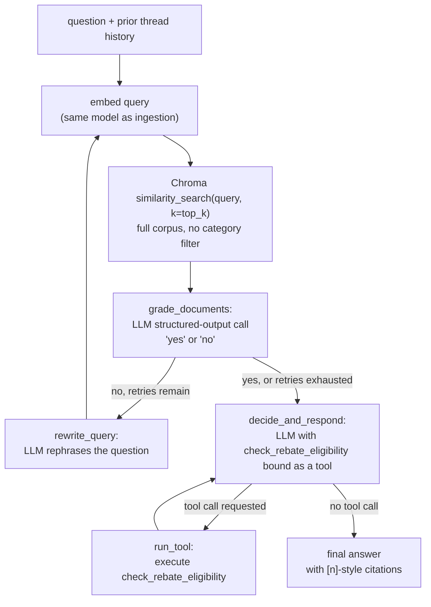

# Retrieval Pipeline

Covers what happens between a question arriving and an answer with
citations coming back — the live, per-query half of the system (as
opposed to `EMBEDDING_PIPELINE.md`, which covers the one-time/offline
indexing half). Code: `app/graph.py`, `app/tools.py`.

## 1. Pipeline stages



## 2. Why retrieval is "agentic" rather than a fixed retrieve→generate call

Three decision points, each backed by an actual model call rather than a
heuristic, are what make this more than a single pass:

1. **`grade_documents`** — after retrieving, a cheap structured-output call
   (`GradeDocuments{binary_score: "yes"|"no"}`) asks whether the retrieved
   chunks can actually answer the question. This exists because dense
   retrieval on a short, plainly-worded query can miss — e.g. an acronym,
   an unusual phrasing, or a typo landing far from the right chunk in
   embedding space.
2. **`rewrite_query`** — if the grade is `"no"` and `retry_count <
   max_retrieval_retries` (default 2), an LLM call rephrases the query
   (expanding acronyms, resolving ambiguity) and the graph loops back to
   `retrieve`. Bounded, so a persistently bad query gives up gracefully
   after 2 rewrites rather than looping forever.
3. **`decide_and_respond`** — the main generation call has
   `check_rebate_eligibility` bound as a tool (via `llm.bind_tools`). The
   model decides, per-question, whether this needs a live computed
   determination (an eligibility/rebate-amount question) or is answerable
   from the retrieved policy text alone. If it decides to call the tool
   but is missing a required input, the system prompt instructs it to ask
   the user rather than invent a value — enforced via prompt + the tool's
   own docstring (see `app/tools.py`), not a separate code path.

`route_after_grade` and `route_after_decide` (both in `app/graph.py`) are
the two conditional edges implementing this; they're pure functions of
`AgentState` and are unit-tested directly in `tests/test_graph_routing.py`
without needing a live LLM call.

## 3. Retrieval is never filtered by category

`retrieve()` (`app/graph.py::make_retrieve_node`) always does a plain
`vectorstore.similarity_search(query, k=top_k)` across the **entire**
corpus. The `categories`/`ambiguous` metadata attached during ingestion
(see `EMBEDDING_PIPELINE.md` §2.3) is never used as a retrieval filter —
only as citation/traceability metadata surfaced in the response.

This is deliberate, not an oversight. The corpus's own deliberately
ambiguous document (`06_ambiguous_rebate_billing_adjustments.md`) says, in
its own text, that it doesn't belong cleanly under either of the two
categories it touches. Any category-first retrieval design (search only
within "billing" *or* only within "rebates") would have to guess which
one the user's query belongs to before searching — exactly the kind of
premature categorization the document is warning against. Full-corpus
semantic search sidesteps that: the chunk surfaces (or doesn't) on its own
semantic merits regardless of which category label it carries, and the
system prompt (`app/graph.py::SYSTEM_PROMPT`) explicitly instructs the
model to say when an answer spans more than one policy area rather than
silently picking one.

The same principle also covers cross-references the assessment didn't
flag explicitly — installer-certification lapses affecting rebate
eligibility, autopay failure affecting billing adjustments, grievance vs.
appeals processes — none of which needed special-casing because retrieval
was never restricted to a single "bucket" in the first place.

## 4. Context assembly and citations

`app/tools.py::format_docs_for_context()` renders retrieved chunks as:

```
[1] (source: 06_ambiguous_rebate_billing_adjustments.md)
<chunk text>

[2] (source: 02_incentive_rebate_programs.md)
<chunk text>
```

The system prompt instructs the model to cite using these bracketed
numbers inline (`"...as described in [1]."`). The frontend
(`frontend/app.js::renderAnswerHtml`) recognizes this `[n]` / `[n, m]`
pattern and renders it as a small schematic-style citation chip; the API
layer (`app/api.py`) separately returns a deduplicated `sources` list
(the actual filenames) alongside the answer text for anything that wants
the plain list rather than parsing inline markers.

## 5. The eligibility tool as part of retrieval-augmented decision-making

`check_rebate_eligibility` (wrapped in `app/tools.py`) is treated as a
first-class part of the answer pipeline, not a bolt-on. It's bound to the
same `decide_and_respond` call that has the retrieved policy context, so
the model can combine both — e.g. explaining the general rebate policy
from retrieved text *and* running the actual number for a specific
household in the same turn. `run_tool` (`app/graph.py`) executes it and
routes back into `decide_and_respond` once (guarded by
`tool_already_run`) so the model produces a final natural-language answer
incorporating the tool's result rather than stopping at the raw tool
output.

## 6. History-aware retrieval across turns

`run_query(vectorstore, question, history=...)` takes the prior thread's
messages (from `app/threads.py::Thread.messages`, populated by
`app/api.py`) and seeds the graph's `messages` state with them before
appending the new question. This means:

- A clarifying question the agent asked in turn 1 (e.g. "what's your
  annual income?") and the user's answer in turn 2 are both in
  `messages` when `decide_and_respond` runs for turn 2, so the model has
  the full context to complete the tool call correctly.
- **Retrieval itself is still driven by the current turn's `query`,
  not the full history** — `state["query"]` starts as just the latest
  question. This is a deliberate scope boundary: rewriting or expanding
  retrieval queries using conversational history (e.g. resolving "what
  about that?" against a prior topic) is not implemented and would be a
  reasonable next step (see `DESIGN.md`) if multi-turn topic drift becomes
  a real usage pattern.

## 7. Bounding and safety

- `max_retrieval_retries` (default 2) bounds the grade→rewrite loop.
- `recursion_limit` on the compiled graph (`max_agent_steps * 4` in
  `run_query`) is a hard backstop against any unforeseen cycle.
- `tool_already_run` in `AgentState` prevents `decide_and_respond` from
  re-invoking the tool a second time within the same turn after seeing its
  own tool result.
